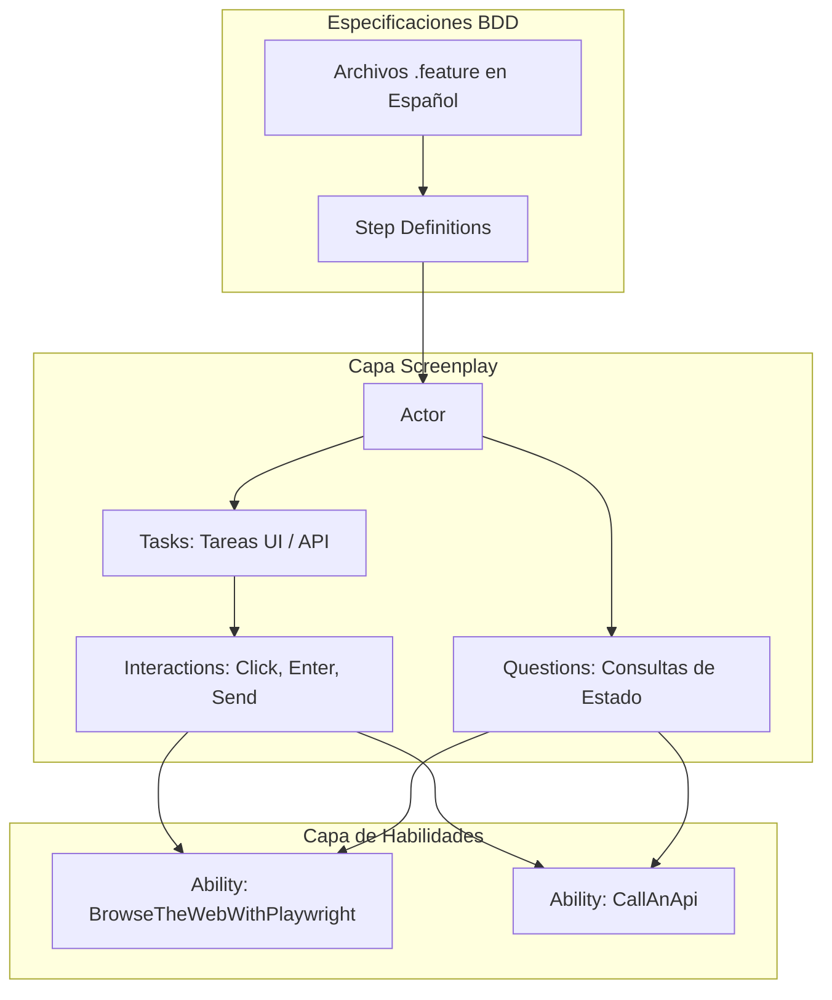

# Framework de Automatización de Pruebas: Playwright + Serenity/JS (Screenplay) + Cucumber BDD

Framework de pruebas automatizadas modular y escalable para aplicaciones Web (UI) y servicios REST (API), implementando el **Patrón Screenplay** con **Serenity/JS**, **Playwright** y especificaciones BDD en español (`# language: es`) con **Cucumber.js**.

---

## 🏛️ Arquitectura del Framework (Patrón Screenplay)

El framework sigue estrictamente los principios del **Patrón Screenplay**:



### 📁 Estructura del Proyecto

```text
Playwright_2/
├── features/                            # Especificaciones de negocio en Gherkin
│   ├── autenticacion/
│   │   └── login.feature                # Escenarios UI (# language: es)
│   ├── usuarios_api/
│   │   └── gestion_usuarios.feature     # Escenarios API (# language: es)
│   ├── step-definitions/                # Steps delgados (delega al Actor)
│   │   ├── autenticacion.steps.ts
│   │   └── gestion_usuarios.steps.ts
│   └── support/                         # Configuración BDD, Cast y Hooks
│       ├── elenco.ts                    # Cast dinámico de Actores y Habilidades
│       ├── hooks.ts                     # Hooks Before/After y ciclo de vida de Playwright
│       └── serenity.config.ts           # Configuración de Serenity BDD Reporters
├── src/                                 # Capa Screenplay
│   ├── domain/                          # Modelos y DTOs
│   │   └── models/
│   │       ├── Credenciales.ts
│   │       └── Usuario.ts
│   └── screenplay/
│       ├── ui/                          # Selectores declarativos (PageElements)
│       │   ├── FormularioLoginUI.ts
│       │   └── InventarioUI.ts
│       ├── tasks/                       # Tareas de negocio reutilizables
│       │   ├── ui/
│       │   │   ├── IniciarSesion.ts
│       │   │   └── NavegarA.ts
│       │   └── api/
│       │       ├── CrearUsuario.ts
│       │       └── ConsultarUsuario.ts
│       └── questions/                   # Verificaciones de estado sin efectos secundarios
│           ├── ui/
│           │   ├── MensajeError.ts
│           │   └── TituloPagina.ts
│           └── api/
│               └── RespuestaApi.ts
├── .env.example                         # Plantilla de variables de entorno
├── cucumber.js                          # Configuración de ejecución de Cucumber
├── package.json                         # Dependencias y scripts de prueba
└── tsconfig.json                        # Configuración de TypeScript
```

---

## 🚀 Comandos de Ejecución

### 1. Ejecutar toda la suite (UI + API)
```bash
npm test
```

### 2. Ejecutar solo pruebas de UI
```bash
npm run test:ui
```

### 3. Ejecutar solo pruebas de API
```bash
npm run test:api
```

### 4. Generar Reporte Serenity BDD HTML
```bash
npm run test:report
```
*(Requiere Java JRE 11+ instalado en el sistema para compilar el HTML)*

### 5. Limpieza de reportes anteriores
```bash
npm run clean
```

---

## ⚙️ Configuración (.env)

Puedes configurar el comportamiento de ejecución modificando las variables en el archivo `.env`:

```env
# URLs base
BASE_URL_UI=https://www.saucedemo.com
BASE_URL_API=https://reqres.in

# Configuración de navegador Playwright
HEADLESS=true
BROWSER=chromium
DEFAULT_TIMEOUT=15000
```

---

## 🛡️ Reglas de Oro para Mantener la Escalabilidad

1. **Step Definitions Delgados:** Nunca interactuar directamente con `page` o APIs en los steps. Siempre usar `actorCalled(nombre).attemptsTo(...)`.
2. **Tasks sin Aserciones:** Las `Tasks` ejecutan flujos de acciones. Las aserciones pertenecen exclusivamente a `Ensure.that(Question, Expectation)` en los Steps o Tasks de verificación.
3. **UI Elements Puros:** Los archivos `*UI.ts` solo exportan descriptores de `PageElement.located(...)`, sin métodos de acción.
4. **Questions Puras:** Las `Questions` solo leen y transforman el estado actual, sin provocar efectos secundarios (clicks, navegación, etc.).
